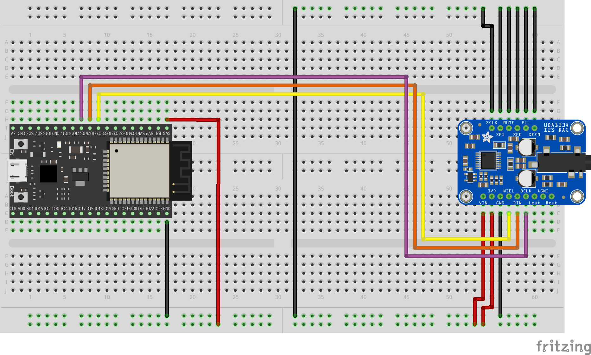

..
    Copyright 2021 MbedCraft. All rights reserved.
    Use of this source code is governed by a MIT license that can be found
    with this software.

==========
 BTPlayer
==========

BTPlayer is a bluetooth player implemented on the ESP32 MCU using the ESP-IDF
framework

This project uses the following stacks from the ESP-IDF framework:

- Bluetooth: especially the profiles AD2P and GAP
- SPIFFS: to store the AAC sound resources
- NVS: to store the Bluetooth calibration parameters

--------------
 Requirements
--------------

To run this project, you will need:

- An ESP32 development board (i.e. DevKit-C)
- An Stereo I2S DAC with 3.3 logic (i.e. UDA1334A)

--------------
 Dependencies
--------------

ESP-IDF framework v4.2

-----------------
 Getting Started
-----------------

Building and Flashing
=====================

Linux
-----

#. Setup the ESP-IDF framework (see: https://github.com/espressif/esp-idf)
#. Export the ESP-IDF environment: ``source <esp-idf_path>/export.sh``
#. Clone the repository:
   ``git clone --recurse-submodules https://github.com/MbedCraft/mc_btplayer.git``
#. in the mc_btplayer directory:

   - ``idf.py build``
   - ``idf.py flash``

Windows
-------

TODO

Hardware Setup
==============

======== ==================
 ESP32    I2S DAC
======== ==================
 GPIO25   WS (WORD SELECT)
-------- ------------------
 GPIO26   I2S DATA
-------- ------------------
 GPIO27   BCLK (BIT CLOCK)
======== ==================

.. Note:: The GPIO can be configured with ``idf.py menuconfig``

Pairing
=======

The pairing uses the standard Secure Simple Pairing procedure
(see: https://en.wikipedia.org/wiki/Bluetooth#Pairing) with
Man In The Middle protection (MITM).

This requires to proceed to a numeric comparison:

#. The connecting device (i.e. Smartphone) sends a number to the BTPlayer
#. The BTPlayer tells the numeric value to the user through the audio DAC
   (i.e. with a headset or a speaker).
#. If the numeric value told by the BTPlayer and the one displayed on the
   smartphone matches, the user can accept the pairing.
